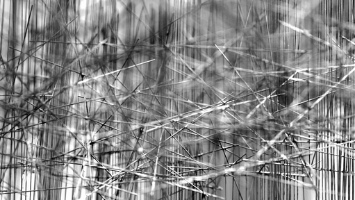

# Sheaves in a nutshell

<figure>
  
</figure>

## About

Do not be missleading by the title, this work is a reproduction, using [typst](https://typst.app/) of a series of articles written by Bartosz Milewski on his blog, [Bartosz Milewski's Programming Cafe](https://bartoszmilewski.com/about/).

## List of blog post

- [x] [Topology as a Dietary choice](https://bartoszmilewski.com/2024/07/12/topology-as-a-dietary-choice/)
- [ ] [Presheaves and Topology](https://bartoszmilewski.com/2024/08/07/presheaves-and-topology/)
- [ ] [Sheaves and Topology](https://bartoszmilewski.com/2024/08/18/sheaves-and-topology/)
- [ ] [Coverages and sites](https://bartoszmilewski.com/2024/10/07/coverages-and-sites/)
- [ ] [Sheaves as Virtual Objects](https://bartoszmilewski.com/2024/10/24/sheaves-as-virtual-objects/)

## License

<figure>
  
  <figcaption>This work is licensed under a Creative Commons Attribution 4.0 International License.</figcaption>
</figure>
